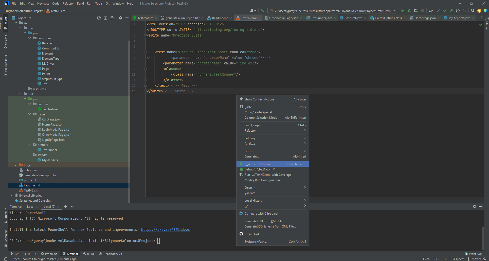
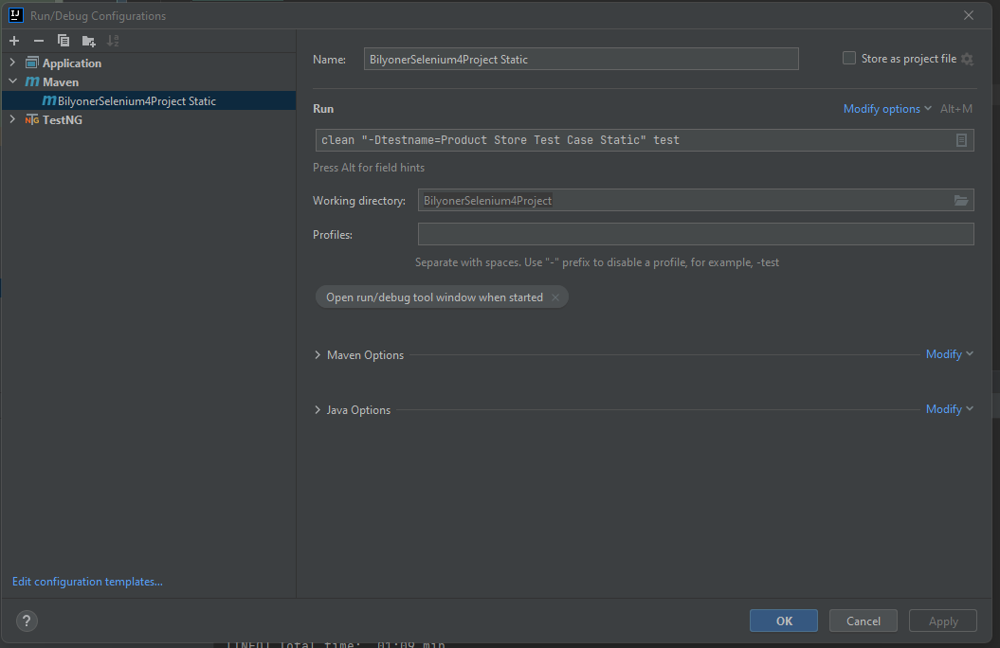
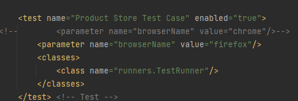
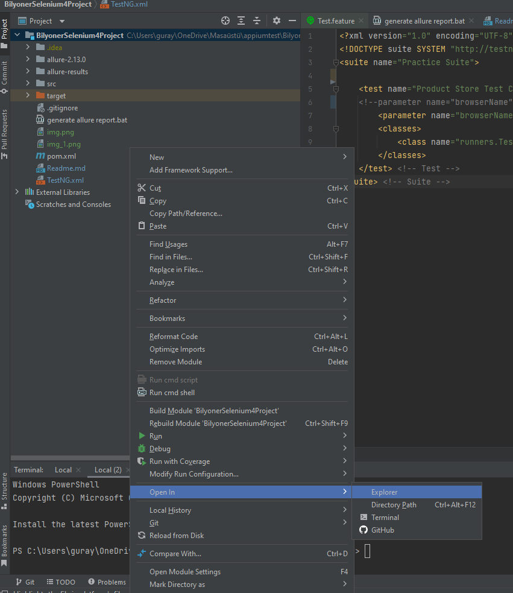
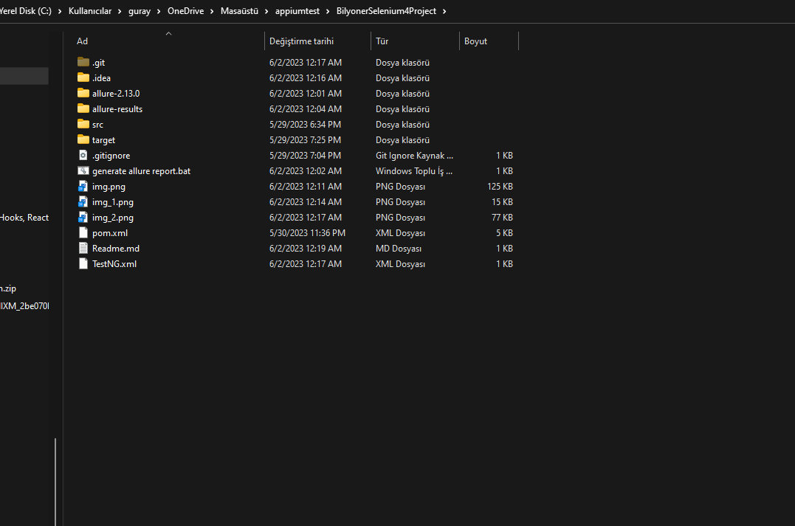
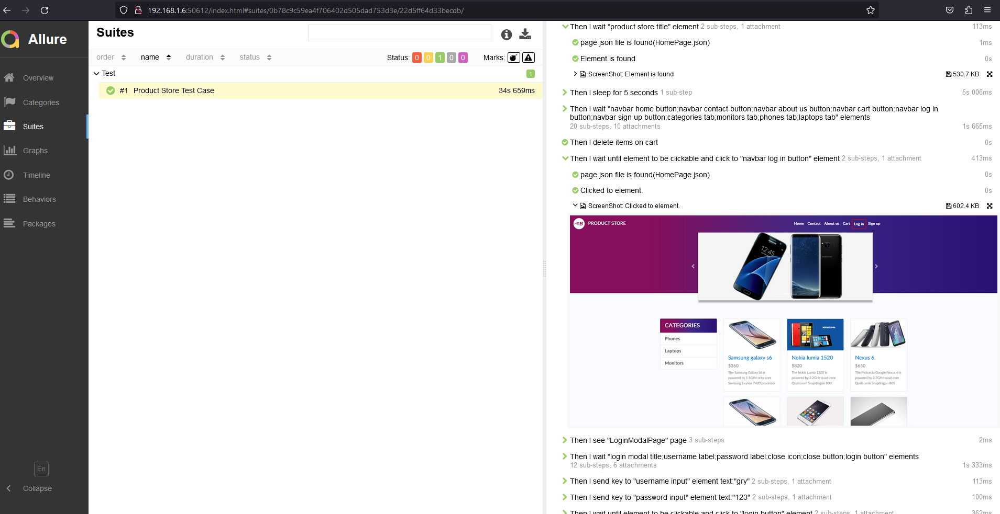

1.Çalıştırma

    a.TestNG.xml üzerinde sağ click yaparak "Run TestNG.xml" seçeneği ile çalıştırabilirisiniz. 

    b.Maven üzerinden çalıştırma

2.Browser değiştirme

browserName parametresini "chrome" veya "firefox" seçerek testi istediğiniz tarayıcıda çalıştırebilirsiniz.

3.Allure Report Oluşturma

    a.Project explorerda boş bir yere sağ click yapıp projenin bulunduğu dizine gidiyoruz.

    b.Proje Dizini

    Burada generate allure report bat dosyasını çalıştırmanız yeterlidir.

4.Allure Report

